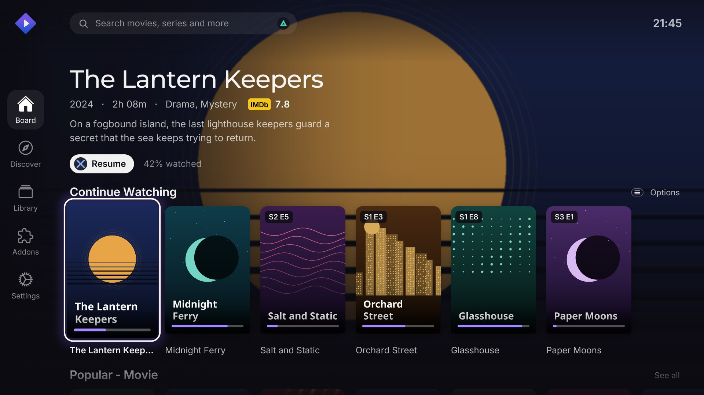
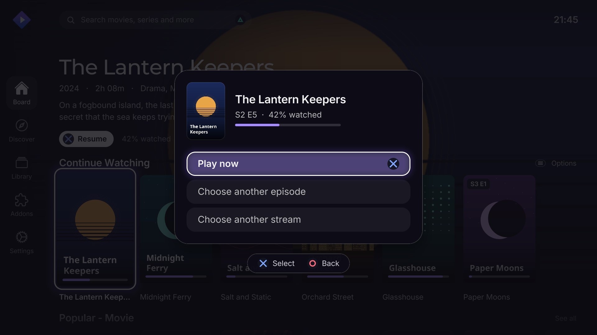
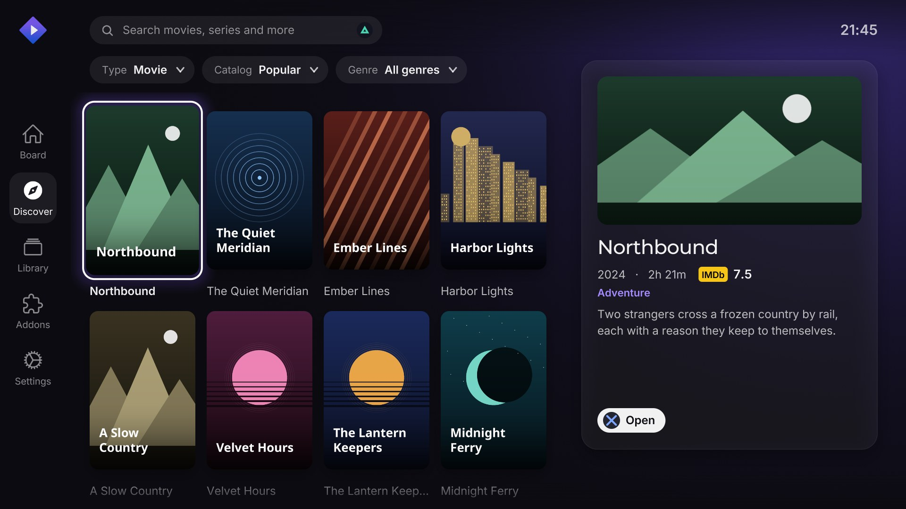
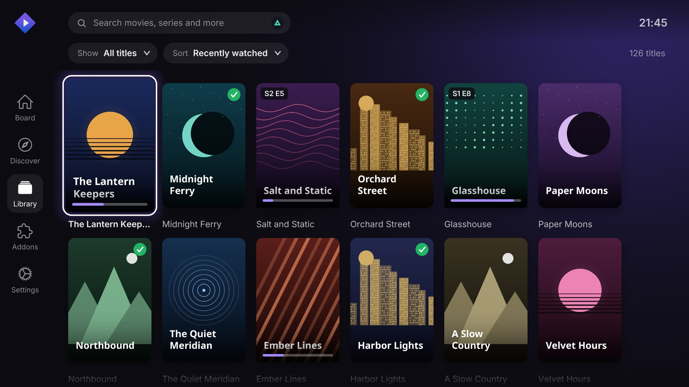
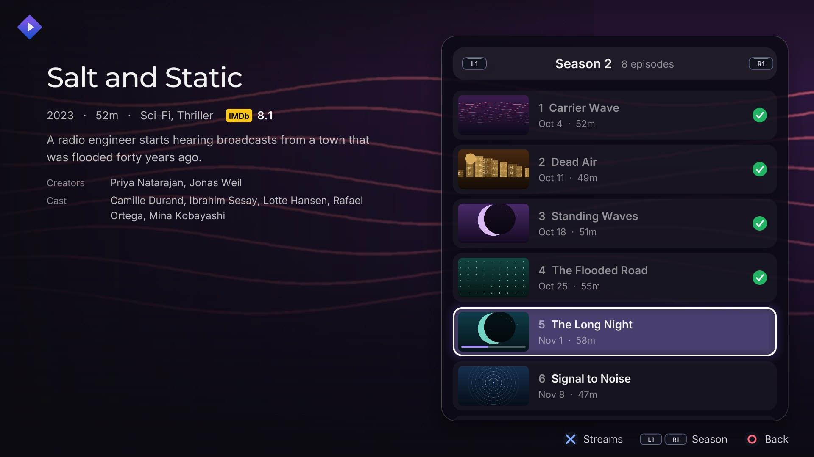
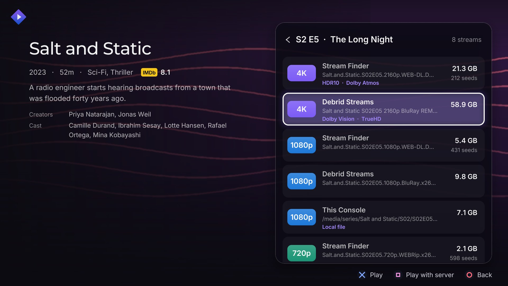
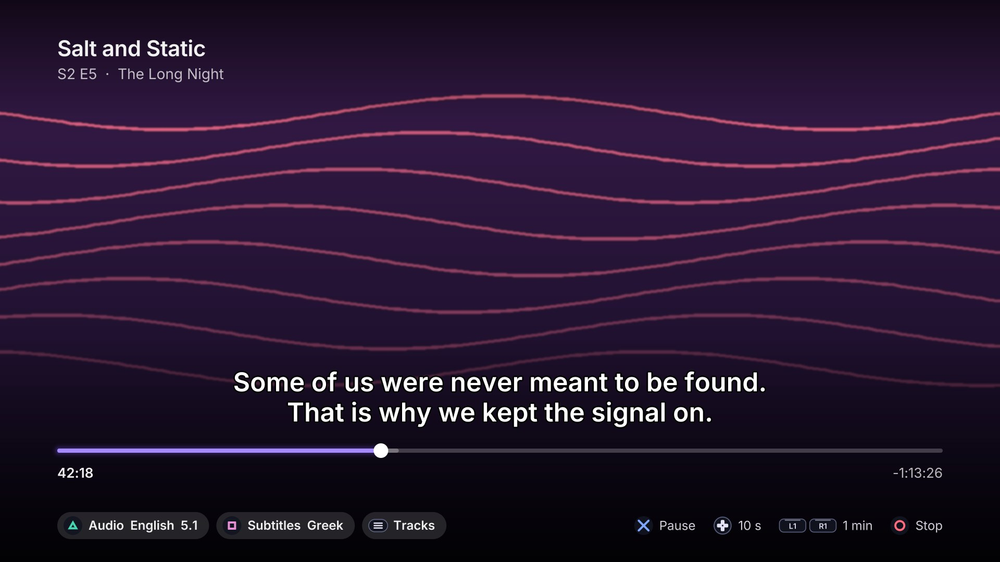
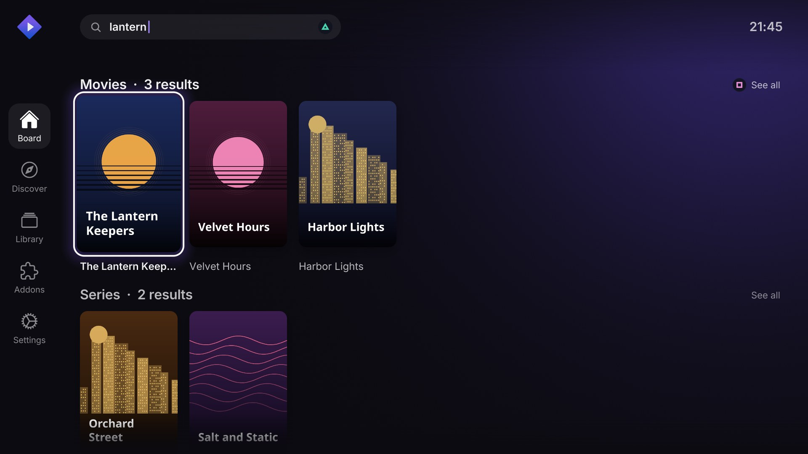

# Unofficial Stremio PS5 Port

[](https://ko-fi.com/sp9nky)

> [!IMPORTANT]
> **Version 1.0 is a full redesign of the app.** Every screen was rebuilt from
> scratch. See [What's new in 1.0](#whats-new-in-10).
>
> **Stremio now lives in the Games section of the PlayStation home screen.** From
> 1.0 it is a game-type title (before, it was under Media). If you have an older
> version, remove it first: see [Install](#install).
>
> **Since version 0.2.0, no Stremio streaming server is needed.**
> <ins>**The app streams movies and TV shows directly on the console**</ins>:
> torrents are downloaded by the app's own built-in torrent engine, and
> direct links (e.g. debrid services) play straight from their source.

A Stremio client for jailbroken PlayStation 5 consoles, running as a native
app on the home screen: browse your catalogs and library, pick a stream, and
watch it, all with the DualSense.

> **Unofficial.** This project is not affiliated with, endorsed by or
> supported by Stremio, or by Sony Interactive Entertainment. It has no
> connection with either. "Stremio" and its logo are trademarks of their
> owner; "PlayStation", "PS5" and "DualSense" are trademarks of Sony
> Interactive Entertainment Inc. No Sony code, SDK, keys or firmware files
> are included.

## Screenshots

<table>
  <tr>
    <td width="50%"><a href="docs/screenshots/home.jpg"></a><br><sub><b>Home</b>: the wallpaper of the title you are on, and your rows</sub></td>
    <td width="50%"><a href="docs/screenshots/continue-watching.jpg"></a><br><sub><b>Continue Watching</b>: play now, or choose another episode or stream</sub></td>
  </tr>
  <tr>
    <td width="50%"><a href="docs/screenshots/discover.jpg"></a><br><sub><b>Discover</b>: browse any catalog, with a preview</sub></td>
    <td width="50%"><a href="docs/screenshots/library.jpg"></a><br><sub><b>Library</b>: everything you saved or watched</sub></td>
  </tr>
  <tr>
    <td width="50%"><a href="docs/screenshots/episodes.jpg"></a><br><sub><b>Episodes</b>: seasons, what you have watched, where you stopped</sub></td>
    <td width="50%"><a href="docs/screenshots/streams.jpg"></a><br><sub><b>Streams</b>: grouped by resolution, with size and seeds</sub></td>
  </tr>
  <tr>
    <td width="50%"><a href="docs/screenshots/player.jpg"></a><br><sub><b>Player</b>: subtitles, audio tracks, seeking</sub></td>
    <td width="50%"><a href="docs/screenshots/search.jpg"></a><br><sub><b>Search</b>: with the PS5's own keyboard</sub></td>
  </tr>
</table>

The titles and artwork in these pictures are invented (made by `tools/preview`).

## What's new in 1.0

**A full redesign.** The whole interface is new: it keeps Stremio's look and is
drawn on the console's GPU, at 4K when your TV supports it (1080p otherwise).

And more besides the new look:

- **Now in the Games section.** Stremio is a game-type title, so it shows up under
  Games on the PlayStation home screen. It also gets all of the console's direct
  memory (about 11 GB instead of about 2 GB), which the artwork and the video decoder
  use.
- **Hardware decoding reworked** for the new interface: the video goes from the
  console's decoder to the GPU for display, and the player shows whether hardware
  or software decoding is in use.
- **Continue Watching picks up where you left off**: it plays the same episode with
  the same stream, at the point where you stopped, and after a finished episode it
  goes on to the next one.
- **○ always takes you back**, all the way to the Board.
- **The video pauses by itself** when you press the PS button.
- **Faster, sharper pictures**: the app loads the posters and wallpapers before it
  shows the home screen, and uses higher-resolution wallpapers where they exist.
- **Soft interface sounds** when you move around, switch page or go back (turn them
  off in Settings, **Interface sounds**).
- **Search** opens the PS5's own keyboard, at the top right of the screen.
- Everything of 0.3.x is still here: the built-in torrent engine, direct links,
  subtitles (including Arabic and Hebrew) and sign-in with a code.

## What's new in 0.3.1

- **Arabic subtitles fixed**: they showed as white boxes; they now show in
  an Arabic font, right to left, with joined letters.

## What's new in 0.3.0

Fewer buffering stops:

- **Long read-ahead on the console's storage**: the app now uses up to
  16 GB of the PS5's storage. Built-in torrents keep a 6 GB cache and
  download up to 3 GB (about a quarter of an hour of 4K) ahead of what
  you're watching; streams from a streaming server or a direct link keep up
  to 6 GB ahead.
- **Six connections for streaming-server streams** too (before, only direct
  links): one connection from a server measured 3-6 MB/s, six about 8 MB/s.
- If a source is slower than the video itself (a torrent with few seeders),
  it can still stop: pick a stream with more seeders or a smaller file.

## What's new in 0.2.0

- **Streams directly on the console**: a built-in torrent engine (trackers,
  DHT, peer exchange) downloads just ahead of what you're watching, into a
  rolling 1 GB cache, and bans peers that send bad data.
- **Hardware video decoding**: H.264, HEVC (8 and 10-bit) and VP9 up to 4K
  decode on the PS5's own video hardware; other formats fall back to
  software decoding.
- **HDR10 tone mapping**: 4K HDR titles are converted to the TV's normal
  range with correct colours.
- **Faster direct links**: big files are downloaded over several
  connections at once.
- **Smarter buffering**: the buffer adapts to the video's bitrate and to how
  well the download keeps up, so playback stops less.

## Features

- **Sign in** with your Stremio account (QR code / link code); your addons
  and library sync from your account.
- **Board, Discover, Library, Addons, Settings** pages in Stremio's colours,
  with poster art, wallpapers and smooth scrolling.
- **Search** with the PS5's on-screen keyboard.
- **Title pages** with seasons and episodes; streams grouped by resolution
  (4K, 1080p, 720p, ...) before you pick one.
- **Player** (FFmpeg, hardware decoding) with subtitles (from addons), audio
  track selection, seeking, and resume (Continue Watching).
- **Torrent statistics** (peers, speed, progress) while a torrent starts.
- **One native app**: no launcher, no payload sender and no server needed.

## Requirements

- A jailbroken PS5 that can run homebrew titles, with
  [ShadowMountPlus](https://github.com/drakmor/ShadowMountPlus) (or another
  tool that mounts `.ffpfsc` images) and fake-signed app support (e.g.
  [kstuff](https://github.com/EchoStretch/kstuff) /
  [etaHEN](https://github.com/etaHEN/etaHEN)).
  Developed and tested on firmware **11.60**.

## Install

1. Download `PPSA77711.ffpfsc` from the [Releases](../../releases) page.
2. Copy it to `/data/homebrew/` on the console (FTP, PS5 Upload, ...).
3. ShadowMountPlus registers it: start **Stremio** from the **Games** section of
   the home screen.
4. In **Settings**, sign in to your Stremio account.

To update (also from 0.x), close Stremio first, delete the old
`PPSA77711.ffpfsc`, wait a few seconds, then copy the new one. (If the image is
replaced while the app is running, the console keeps the old icon and
backgrounds.)

> [!NOTE]
> Version 1.0 keeps the title ID `PPSA77711`, but it is a game-type title: it
> appears in the **Games** section, where 0.x was under Media.

The app keeps its settings, artwork cache, read-ahead caches and log in its
own storage (`/download0/stremio`, up to 16 GB), the same place as before, so
your sign-in should carry over; if it doesn't, sign in again.

## Controls

| Where | Button | Action |
| --- | --- | --- |
| Everywhere | ✕ / ○ | select / back (○ from any page goes to the Board) |
| | D-pad, left stick | move |
| | △ or Options | search |
| Board | □ | See all (not on Continue Watching) |
| | ✕ on a Continue Watching card | play now / choose another episode / choose another stream |
| | Options, on a Continue Watching card | remove it (asks first) |
| Addons | □ | reload the addons |
| | ✕ on an addon you added by URL | remove it |
| Title page, episodes | ✕ | choose the episode |
| | L1 / R1 | previous / next season |
| | △ | mark the episode watched / not watched |
| Title page, streams | ✕ | play |
| | □ | play with the streaming server |
| Player | ✕ or touchpad | pause / play |
| | D-pad left / right | seek 10 s |
| | L1 / R1 | seek 1 min |
| | L3 | back to the start |
| | □ / △ | next subtitle / next audio track |
| | L2 / R2 | subtitle delay -/+ 0.25 s |
| | D-pad up or Options | track menu |
| | ○ | stop |

## Building

Builds run on Linux or WSL (Ubuntu 24.04 tested):

```bash
./build.sh
```

The script installs what it needs (clang 18, the
[ps5-payload-sdk](https://github.com/ps5-payload-dev/sdk) with its prebuilt
libraries,
[ps5-native-app-boilerplate](https://github.com/blackbearreloaded/ps5-native-app-boilerplate)
for the PS5 tooling, and, through
[ps5-homebrew-ui](https://github.com/blackbearreloaded/ps5-homebrew-ui)'s own
script, the [ps5-opengl](https://github.com/blackbearreloaded/ps5-opengl) SDK,
a pinned release that is checked against its SHA-256), then writes:

- `dist/PPSA77711.ffpfsc`: the app as one image file, for `/data/homebrew/`
- `dist/PPSA77711/` (and `.zip`): the same as a folder (if you copy the folder
  instead, make sure `eboot.bin` keeps its execute permission)

`tools/preview/preview.sh` renders the screens on a PC (Linux or WSL with
Mesa's software OpenGL) as pictures, with invented sample art, for working on
the design without a console.

### How it works

Stremio is compiled with the payload SDK's compiler, linked with the full C++
runtime and the OpenGL SDK, and turned into a signed native `eboot.bin` by the
boilerplate's converter (`gl/build.sh`). The screens are drawn by the
ps5-homebrew-ui toolkit (vendored in `third_party/hui`) with OpenGL 4.6 on the
console's GPU. A native title runs in a sandbox with a minimal C runtime, so
`native/` adds what the libraries need there:

- `heap.c`: the malloc heap in direct memory (a title's flexible memory is
  only a few hundred MB), 32-byte aligned, leaving room for the video decoder;
- `posix_fixes.c`: 8 MB thread stacks, `pipe()` as a socket pair;
- `console_curl.c`: name lookup through the console's resolver, socket fixes;
- `kernel_mem.c`: memory mapping through the console's own library;
- `ps5_modules.c`: loads the on-screen keyboard module before first use;
- `hui_runtime_shims.c`: the process-level shims the OpenGL runtime needs;
- `stubs/`: link stubs for system modules the SDK has none for (the video
  decoder).

`native/check_imports.py` lists any system function that would resolve to a
module the console doesn't load into an app.

### Project layout

```
gl/           the app's logic and entry point: accounts, catalogs, library, search,
              playback, the artwork cache, the PS5 keyboard dialog, the main loop
ui/           the screens and their look: Board, Discover, Library, Addons, Settings,
              title page, player controls, pop-ups, the boot screen
src/          what is underneath: the Stremio API, HTTP, the FFmpeg player and hardware
              decoder, subtitles, audio output
src/torrent/  the built-in torrent engine and the player's torrent input
native/       native PS5 build: link script, runtime fixes, stubs
third_party/  hui (ps5-homebrew-ui, vendored), nlohmann/json, stb_image
app/          what the console reads: icons, fonts, certificates, the home-screen
              icon and pictures (sce_sys), licenses/ (license texts shipped inside the app)
tools/        preview/ (renders the screens on a PC), make_icons.sh (icons from
              stremio-icons), make_boot_art.py and make_dds.ps1 (the boot screen's name and
              the console's start-up pictures)
```

## Status and known limitations

- The PS5 doesn't let the app accept incoming connections, so torrents only
  use peers the app can connect to; torrents with few reachable seeders start
  slowly or stop to buffer.
- Some formats (AV1, 4K HEVC coded in tiles) decode in software and can
  stutter at 4K.
- HDR is shown tone mapped, not as HDR; Dolby Vision plays its HDR10 layer.
- Titles and texts in Hebrew, Chinese, Japanese and Korean have no font in the
  interface yet (they show as "?"), and the interface isn't mirrored for
  right-to-left languages. Subtitles in Arabic and Hebrew are shown correctly.
- Some wallpapers are only available in 1280x720 at the image service Stremio
  uses; they are enlarged and sharpened, but cannot look as sharp as full HD ones.
- A Stremio streaming server is optional: set one in Settings only if you
  want server transcoding or prefer it for torrents.

## Credits and licenses

Licensed under the [GNU GPL v3.0](LICENSE). This app stands on the work of many
developers; thank you to all of them:

- **BlackBearReloaded**: [ps5-homebrew-ui](https://github.com/blackbearreloaded/ps5-homebrew-ui),
  the OpenGL interface toolkit this version is built on (renderer, controller
  input, text and shapes, runtime shims; vendored in `third_party/hui`), and its
  sound mixer and the *Glass* interface sounds (from ProsperoEden, generated with
  ElevenLabs Sound Effects);
  [ps5-opengl](https://github.com/blackbearreloaded/ps5-opengl), which makes
  OpenGL 4.6 run on the PS5, together with [Mesa](https://mesa3d.org/) and
  OpenGNM PSBC; and
  [ps5-native-app-boilerplate](https://github.com/blackbearreloaded/ps5-native-app-boilerplate),
  the native-app foundation and tooling (with parts derived from
  [SharpProspero](https://github.com/SvenGDK/SharpProspero) by SvenGDK).
- The [ps5-payload-sdk](https://github.com/ps5-payload-dev/sdk) and its
  [PacBrew](https://github.com/ps5-payload-dev/pacbrew-repo) libraries
  (FFmpeg, libcurl, OpenSSL, libwebp, GNU FriBidi, miniupnpc and more).
- The [Kodi port for PS5](https://github.com/VivaLaVent/kodi-ps5) (Team Kodi,
  VivaLaVent): techniques for the heap, thread stacks and the keyboard dialog.
- [Nuvio PS5](https://github.com/theghostonline/Nuvio-PS5) (Husam Osman): the
  hardware video decoding and parallel downloads were ported from it.
- [dht](https://github.com/jech/dht) (Juliusz Chroboczek) and
  [miniupnpc](https://github.com/miniupnp/miniupnp) (Thomas Bernard): the
  torrent engine's peer discovery and port mapping.
- [stb](https://github.com/nothings/stb) (Sean Barrett): image loading, and the
  font baking behind the interface's text;
  [nlohmann/json](https://github.com/nlohmann/json) (Niels Lohmann);
  [libwebp](https://chromium.googlesource.com/webm/libwebp) (Google): the
  posters' format; Inigo Quilez's published distance functions, behind the
  shapes the toolkit draws.
- Fonts: [Inter](https://github.com/rsms/inter) (The Inter Project Authors),
  [Montserrat](https://github.com/JulietaUla/Montserrat) (The Montserrat Project
  Authors) and [DejaVu](https://dejavu-fonts.github.io/) for the interface (the
  toolkit also ships Press Start 2P and Patrick Hand); Noto Sans, Noto Emoji and
  Noto Naskh Arabic UI (Google) for other scripts.
- Build tools: [MkPFS](https://github.com/PSBrew/MkPFS) (PSBrew) for packaging,
  Microsoft's [DirectXTex](https://github.com/microsoft/DirectXTex) for the
  console's start-up pictures, [librsvg](https://gitlab.gnome.org/GNOME/librsvg)
  for the icons and [Pillow](https://python-pillow.org/) for the pictures and
  the screen previews.
- On the console, the app relies on
  [ShadowMountPlus](https://github.com/drakmor/ShadowMountPlus) (drakmor),
  [etaHEN](https://github.com/etaHEN/etaHEN) and
  [kstuff](https://github.com/EchoStretch/kstuff); none of them is included.
- [Stremio](https://github.com/Stremio): [stremio-icons](https://github.com/Stremio/stremio-icons)
  and [stremio-video](https://github.com/Stremio/stremio-video), and the logo
  from [dashboard-icons](https://github.com/homarr-labs/dashboard-icons)
  (homarr-labs). The app uses Stremio's public services for your account.
- Posters, wallpapers and descriptions come from the addons you use (for example
  Cinemeta and its image service) and belong to their owners.

See [THIRD_PARTY.md](THIRD_PARTY.md) for every component, where it is used and
its license.

## Note

This project is vibe coded: it was built with the help of AI.
